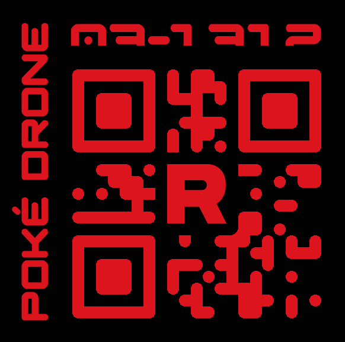

# Drone ID Maker

Python Library for creating drone IDs



## Install Dependancies

```bash
pip install -r requirements.txt
```

## Usage

```python
# import the class
from id_number import DroneTag

# Make a drone
drone_data = {
    "name": "Rory",
	"drone_id": "03-1312"
	"qr_data": "03-1312"
    "title": "Poké Drone",
    "front_color": "#DC141E",
	"back_color": "#000000",
	"id_size": 83,
	"title_size": 69,
    "logo": "./assets/logo.png",
	"logo_color": "#DC141E",
    "logo_size": 0.2,
    "logo_border": 0.2
	"border_radius": 0.125
}
drone_tag = DroneTag(drone_data)
# More Examples in id_number.py
```
